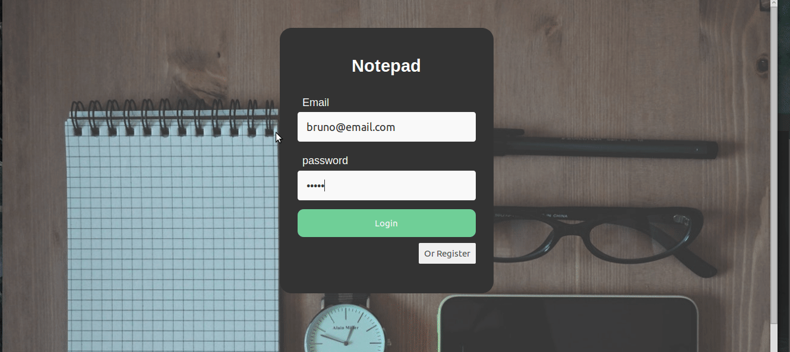

# Front End part for notepad App

:warning: 
##### only works with notepad backend installed and running
[Install notepad-backend](https://github.com/BrunoMendes41/notepad-backend)

###### Demo:
login:

app:

##### installing and running 
after with the backend running

- install the dependencies with the command `yarn` or `npm install`
- and run the app with `yarn start` or `npm start`
- the app will listen in localhost:3000