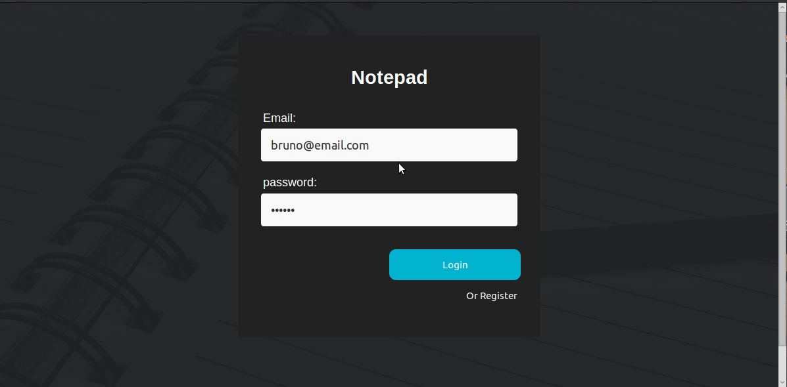

# Front End part for notepad App

##### only works with notepad backend installed and running :warning: 
[Install notepad-backend](https://github.com/BrunoMendes41/notepad-backend)

##### installing and running 
with the backend running

- install the dependencies with the command `yarn` or `npm install`
- and run the app with `yarn start` or `npm start`
- the app will listen in localhost:3000

###### Demo:
login:

app:

